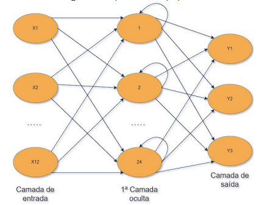
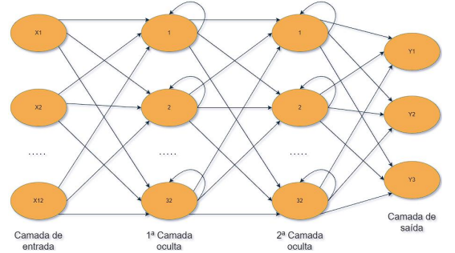
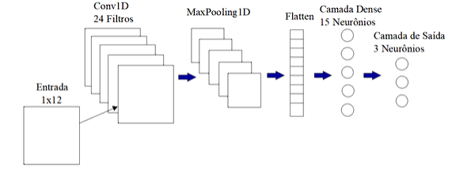

# 🛒 Previsão do Preço da Cesta Básica - Ilhéus e Itabuna

Sistema de previsão de preços utilizando Deep Learning para análise e projeção dos valores da cesta básica e seus produtos individuais nas cidades de Ilhéus e Itabuna, Bahia.

## 📋 Índice

- [Sobre o Projeto](#sobre-o-projeto)
- [Arquiteturas de Redes Neurais](#arquiteturas-de-redes-neurais)
- [Tecnologias Utilizadas](#tecnologias-utilizadas)
- [Configuração do Ambiente](#configuração-do-ambiente)
- [Estrutura do Projeto](#estrutura-do-projeto)
- [Como Usar](#como-usar)
- [Configurações](#configurações)
- [Resultados e Visualizações](#resultados-e-visualizações)
- [Produtos Analisados](#produtos-analisados)
- [Contribuindo](#contribuindo)

## 🎯 Sobre o Projeto

Este projeto implementa três modelos de aprendizado profundo para prever o preço da cesta básica e seus produtos individuais nas cidades de Ilhéus e Itabuna, Bahia. O sistema utiliza séries temporais históricas de preços para realizar previsões de curto e médio prazo (3 a 12 meses).

### Características Principais

- ✅ Previsão do valor total da cesta básica
- ✅ Previsão individualizada para 12 produtos
- ✅ Três arquiteturas de redes neurais implementadas (RNN, LSTM, CNN)
- ✅ Análise comparativa entre duas cidades
- ✅ Geração automatizada de gráficos e relatórios
- ✅ Histórico completo de previsões anteriores

### Modelos Implementados

1. **RNN (Recurrent Neural Network)** - Rede Neural Recorrente simples
2. **LSTM (Long Short-Term Memory)** - Rede com memória de longo prazo
3. **CNN (Convolutional Neural Network)** - Rede Neural Convolucional 1D

## 🧠 Arquiteturas de Redes Neurais

### Rede Neural Recorrente (RNN)

A RNN básica processa sequências temporais mantendo informações de estados anteriores.

<div align="center">



**Arquitetura:** Input(12 meses) → SimpleRNN(24 neurônios) → Dense(n_previsões)

</div>

### Rede Neural LSTM

A LSTM resolve o problema de dependências de longo prazo através de gates de memória.

<div align="center">



**Arquitetura:** Input(12 meses) → LSTM(32) → LSTM(32) → Dense(n_previsões)

</div>

### Rede Neural Convolucional (CNN)

A CNN 1D aplica filtros convolucionais para extrair padrões temporais.

<div align="center">



**Arquitetura:** Input(12 meses) → Conv1D(24 filtros) → MaxPooling1D → Flatten → Dense(15) → Dense(n_previsões)

</div>

## 🛠️ Tecnologias Utilizadas

### Principais Bibliotecas

- **Python 3.12** - Linguagem de programação
- **TensorFlow/Keras** - Framework de Deep Learning
- **Pandas** - Manipulação de dados
- **Matplotlib** - Visualização de gráficos
- **Seaborn** - Visualizações estatísticas
- **Scikit-learn** - Pré-processamento e métricas
- **openpyxl** - Leitura de arquivos Excel

## ⚙️ Configuração do Ambiente

### Pré-requisitos

- Conda ou Miniconda instalado
- Python 3.12 ou superior
- Git (opcional)

### Instalação

1. **Clone o repositório**

    ```bash
    git clone https://github.com/matheusssilva991/redes-neurais-previsao-cesta-basica-Ilheus-Itabuna.git
    cd redes-neurais-previsao-cesta-basica-Ilheus-Itabuna
    ```

2. **Crie e ative o ambiente Conda**

    ```bash
    # Criar ambiente a partir do arquivo environment.yml
    conda env create -f environment.yml

    # Ativar o ambiente
    conda activate cesta
    ```

3. **Ou usando uv (alternativa moderna)**

    ```bash
    # Instalar dependências via pyproject.toml
    uv sync
    ```

4. **Desativar ambiente (quando necessário)**

    ```bash
    conda deactivate
    ```

## 📁 Estrutura do Projeto

```text
previsao_cestas/
├── data/                                    # Dados de entrada
│   └── datasets_produtos/                   # Datasets por produto e cidade
│       ├── ilheus/                          # Dados de Ilhéus
│       └── itabuna/                         # Dados de Itabuna
├── img/                                     # Imagens das arquiteturas
│   ├── RedeRNN.png
│   ├── RedeLSTM.png
│   └── RedeCNN.png
├── output/                                  # Resultados gerados
│   ├── figure/                              # Gráficos de visualização
│   │   ├── produtos_ilheus/                 # Gráficos dos produtos de Ilhéus
│   │   └── produtos_itabuna/                # Gráficos dos produtos de Itabuna
│   ├── models/                              # Modelos treinados (.keras)
│   │   ├── ilheus/                          # Modelos de Ilhéus
│   │   │   └── produtos/                    # Modelos por produto
│   │   └── itabuna/                         # Modelos de Itabuna
│   │       └── produtos/                    # Modelos por produto
│   ├── previsoes_cesta/                     # Previsões da cesta completa (JSON)
│   └── previsoes_produtos/                  # Previsões por produto (JSON)
│       ├── ilheus/
│       └── itabuna/
├── previsoes_boletim/                       # Histórico de previsões por período
│   ├── 2022/, 2023/, 2024/, 2025/          # Organizados por ano e mês
│   └── previsao_XXXX_completo/             # Previsões anuais completas
├── src/                                     # Código fonte
│   ├── main.ipynb                           # Notebook principal de treinamento
│   └── graficos/                            # Notebooks de visualização
│       ├── grafico_cesta.ipynb              # Gráfico da cesta completa
│       ├── graficos_12_meses.ipynb          # Gráficos de 12 meses
│       └── graficos_produtos.ipynb          # Gráficos por produto
├── tests/                                   # Testes e avaliações
│   ├── avaliar_modelos_cv.ipynb             # Avaliação com validação cruzada
│   └── avaliar_modelos_ultimos_3_meses_2021.ipynb
├── configuracoes.conf                       # Configurações dos modelos
├── configuracoes_graficos.conf              # Configurações dos gráficos
├── environment.yml                          # Dependências Conda
├── pyproject.toml                           # Configuração do projeto (uv/pip)
└── README.md                                # Este arquivo
```

## 🚀 Como Usar

### 1. Treinamento dos Modelos

#### Configurar Parâmetros

Edite o arquivo [configuracoes.conf](configuracoes.conf):

```ini
[DEFAULT]
folder_path = /caminho/para/seus/dados
file = accb_custo_total_ilheus.xlsx
meses = 3                    # Quantidade de meses a prever (3, 6 ou 12)
objeto = cesta basica        # Nome do objeto sendo previsto
regiao = Ilheus              # Cidade: Ilheus ou Itabuna
model = RNN                  # Modelo: RNN, LSTM ou CNN
```

#### Executar Treinamento

1. Abra o Jupyter Lab:

   ```bash
   jupyter lab
   ```

2. Navegue até `src/` e abra [main.ipynb](src/main.ipynb)

3. Execute todas as células para:
   - Treinar o modelo selecionado
   - Gerar previsões
   - Salvar modelo treinado (.keras)
   - Exportar resultados (JSON)

**O notebook processa automaticamente:**

- ✅ Previsão da cesta básica completa
- ✅ Previsões individuais dos 12 produtos

### 2. Visualização dos Resultados

#### Configurar Gráficos

Edite o arquivo [configuracoes_graficos.conf](configuracoes_graficos.conf):

```ini
[CESTA_BASICA]
qtd_meses_previstos = 3
meses_previstos = outubro, novembro, dezembro
meses_anteriores = janeiro, fevereiro, março, abril, maio, junho, julho, agosto, setembro
valores_reais_ilheus = [650.5, 655.3, 660.2, 665.1, 670.8, 675.5, 680.3, 685.2, 690.1]
valores_reais_itabuna = [645.2, 650.1, 655.0, 660.3, 665.7, 670.4, 675.2, 680.1, 685.5]
eixo_y_limite_sup = 750
eixo_y_limite_inf = 600
eixo_y_varia_em = 25
ano_previsao = 2024
modelo_atual = RNN

[PRODUTOS]
pasta = ../../output
# ... outras configurações de produtos
```

#### Gerar Gráficos

**Gráfico da Cesta Completa:**

- Abra [src/graficos/grafico_cesta.ipynb](src/graficos/grafico_cesta.ipynb)
- Execute todas as células
- Gráfico salvo em: `output/figure/previsao_cestaBasica_*.png`

**Gráficos por Produto:**

- Abra [src/graficos/graficos_produtos.ipynb](src/graficos/graficos_produtos.ipynb)
- Execute todas as células
- Gráficos salvos em: `output/figure/produtos_ilheus/` e `output/figure/produtos_itabuna/`

### 3. Formato dos Dados de Entrada

Os arquivos Excel devem conter:

| ano  | preco  |
|------|--------|
| 2020 | 650.50 |
| 2020 | 655.30 |
| ...  | ...    |

**Colunas necessárias:**

- `ano` - Ano da observação
- `preco` - Valor em Reais

## ⚙️ Configurações

### Hiperparâmetros dos Modelos

Os modelos utilizam os seguintes hiperparâmetros (definidos em [main.ipynb](src/main.ipynb)):

```python
look_back = 12              # Janela de 12 meses para previsão
forecast_horizon = 3        # Horizonte de previsão (configurável)
epochs = 150                # Épocas de treinamento
batch_size = 1              # Tamanho do batch
learning_rate = 0.0003      # Taxa de aprendizado (Adam)
```

### Personalização

Para ajustar os modelos, edite as funções em [main.ipynb](src/main.ipynb):

- `RNN_model()` - Arquitetura da RNN
- `LSTM_model()` - Arquitetura da LSTM
- `CNN_model()` - Arquitetura da CNN

## 📊 Resultados e Visualizações

### Formatos de Saída

1. **Modelos Treinados** (.keras)
   - Localização: `output/models/{cidade}/`
   - Formato: `{MODELO}_{cidade}_{objeto}_h{horizonte}.keras`

2. **Previsões** (JSON)
   - Localização: `output/previsoes_cesta/` ou `output/previsoes_produtos/`
   - Formato: `{"objeto": "[valor1, valor2, valor3]"}`

3. **Gráficos** (PNG)
   - Localização: `output/figure/`
   - Visualizações comparativas com valores reais e previstos

### Exemplo de Gráfico

Os gráficos gerados incluem:

- 📈 Valores históricos (9 meses anteriores)
- 📉 Valores previstos (3 meses futuros)
- 🎨 Comparação visual entre Ilhéus e Itabuna
- 🏷️ Anotações com valores exatos

## 🛍️ Produtos Analisados

O sistema analisa os seguintes produtos da cesta básica:

| Produto  | Quantidade | Produto   | Quantidade |
|----------|-----------|-----------|-----------|
| Açúcar   | 3.0 kg    | Leite     | 6.0 L     |
| Arroz    | 3.6 kg    | Manteiga  | 0.75 kg   |
| Banana   | 7.5 kg    | Óleo      | 1.0 L     |
| Café     | 0.3 kg    | Pão       | 6.0 kg    |
| Carne    | 4.5 kg    | Tomate    | 12.0 kg   |
| Farinha  | 3.0 kg    |           |           |
| Feijão   | 4.5 kg    |           |           |

## 📝 Contribuindo

Contribuições são bem-vindas! Para contribuir:

1. Faça um Fork do projeto
2. Crie uma branch para sua feature (`git checkout -b feature/NovaFeature`)
3. Commit suas mudanças (`git commit -m 'Adiciona nova feature'`)
4. Push para a branch (`git push origin feature/NovaFeature`)
5. Abra um Pull Request

## 📄 Licença

Este projeto está sob a licença especificada no arquivo LICENSE.

## 👤 Autor

**Matheus Silva**

- GitHub: [@matheusssilva991](https://github.com/matheusssilva991)

## 🙏 Agradecimentos

- Dados coletados das cidades de Ilhéus e Itabuna, Bahia
- Comunidade Python e TensorFlow/Keras

---

⭐ Se este projeto foi útil para você, considere dar uma estrela no repositório!
