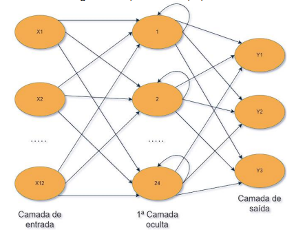
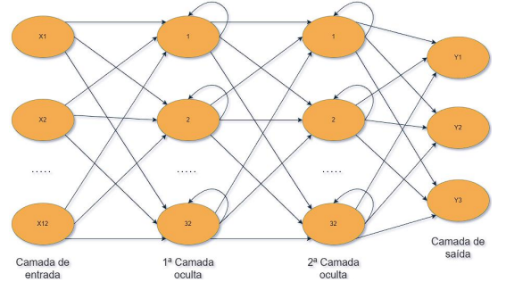
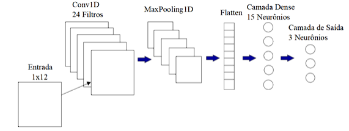

# 🛒 Previsão do Preço da Cesta Básica - Ilhéus e Itabuna

Sistema de previsão de preços utilizando Deep Learning para análise e projeção dos valores da cesta básica e seus produtos individuais nas cidades de Ilhéus e Itabuna, Bahia.

## 📋 Índice

- [Sobre o Projeto](#sobre-o-projeto)
- [Arquiteturas de Redes Neurais](#arquiteturas-de-redes-neurais)
- [Arquitetura do Código](#arquitetura-do-código)
- [Tecnologias Utilizadas](#tecnologias-utilizadas)
- [Configuração do Ambiente](#configuração-do-ambiente)
- [Estrutura do Projeto](#estrutura-do-projeto)
- [Como Usar](#como-usar)
- [Configurações](#configurações)
- [Resultados e Visualizações](#resultados-e-visualizações)
- [Produtos Analisados](#produtos-analisados)
- [Contribuindo](#contribuindo)

## 🎯 Sobre o Projeto

Este projeto implementa três modelos de aprendizado profundo para prever o preço da cesta básica e seus produtos individuais nas cidades de Ilhéus e Itabuna, Bahia. O sistema utiliza séries temporais históricas de preços para realizar previsões de curto e médio prazo (3 a 12 meses).

### Características Principais

- ✅ Previsão do valor total da cesta básica
- ✅ Previsão individualizada para 12 produtos
- ✅ Três arquiteturas de redes neurais implementadas (RNN, LSTM, CNN)
- ✅ Análise comparativa entre duas cidades
- ✅ Geração automatizada de gráficos e relatórios
- ✅ Histórico completo de previsões anteriores

### Modelos Implementados

1. **RNN (Recurrent Neural Network)** - Rede Neural Recorrente simples
2. **LSTM (Long Short-Term Memory)** - Rede com memória de longo prazo
3. **CNN (Convolutional Neural Network)** - Rede Neural Convolucional 1D

## 🧠 Arquiteturas de Redes Neurais

### Rede Neural Recorrente (RNN)

A RNN básica processa sequências temporais mantendo informações de estados anteriores.

<div align="center">



**Arquitetura:** Input(12 meses) → SimpleRNN(24 neurônios) → Dense(n_previsões)

</div>

### Rede Neural LSTM

A LSTM resolve o problema de dependências de longo prazo através de gates de memória.

<div align="center">



**Arquitetura:** Input(12 meses) → LSTM(32) → LSTM(32) → Dense(n_previsões)

</div>

### Rede Neural Convolucional (CNN)

A CNN 1D aplica filtros convolucionais para extrair padrões temporais.

<div align="center">



**Arquitetura:** Input(12 meses) → Conv1D(24 filtros) → MaxPooling1D → Flatten → Dense(15) → Dense(n_previsões)

</div>

## 🏗️ Arquitetura do Código

O projeto foi estruturado seguindo boas práticas de engenharia de software, com código modular e reutilizável.

### Pacotes Principais

#### 📦 `src/models/` - Definições de Modelos

Contém as arquiteturas das redes neurais em um módulo centralizado:

```python
from models import get_model

# Obter modelo configurado
model = get_model('RNN', look_back=12, forecast_horizon=3)
model = get_model('LSTM', look_back=12, forecast_horizon=3)
model = get_model('CNN', look_back=12, forecast_horizon=3)
```

**Arquivos:**

- `neural_networks.py` - Implementações de RNN, LSTM e CNN
- `__init__.py` - Exporta função factory `get_model()`

#### 📦 `src/utils/` - Utilitários

Funções reutilizáveis para processamento de dados e visualização:

**`data_utils.py`** - Processamento e Treinamento

```python
from utils import (
    load_unified_data,      # Carrega séries da tabela única
    create_time_sequences,  # Cria sequências temporais
    prepare_training_data,  # Prepara dados para treinamento
    train_model,            # Treina o modelo
    generate_forecast,      # Gera previsões
    save_forecasts          # Salva resultados em JSON
)
```

**`monthly_data.py`** - Tabela única mensal

```python
from utils import load_price_series, add_or_update_prices

# Lê uma série diretamente de data/precos_mensais.xlsx
df = load_price_series("ilheus", "cesta_basica")
```

**`boletim_data.py`** - Importação de boletins DOCX

```python
from utils.boletim_data import extract_prices_from_boletim

boletim = extract_prices_from_boletim("previsoes_boletim/202605")
```

**`training_workflow.py`** - Fluxo compacto de treino e previsão

```python
from utils import train_and_forecast

summary = train_and_forecast(
    region="ilheus",
    series_name="cesta_basica",
    forecast_type="cesta",
    model_name="RNN",
    look_back=12,
    forecast_horizon=3,
    epochs=150,
    batch_size=1,
    save_onnx=True,
    silence_training=True,
)
```

**`chart_utils.py`** - Visualização

```python
from utils import (
    load_forecasts_for_regions,     # Carrega previsões de regiões
    load_product_forecasts,         # Carrega previsões de produtos
    load_product_historical_data,   # Carrega dados históricos
    setup_plot_style,               # Configura estilo matplotlib
    format_yticks_with_comma,       # Formata eixo Y (vírgula decimal)
    plot_product_chart,             # Plota gráfico de produtos
    plot_forecast_only_chart,       # Plota apenas previsões
    save_figure                     # Salva figura PNG
)
```

### Notebooks Otimizados

Todos os notebooks foram refatorados para usar os pacotes `models/` e `utils/`:

- ✅ **Código sem duplicação** - Funções reutilizadas entre notebooks
- ✅ **Nomenclatura em inglês** - Padrão internacional para funções
- ✅ **Configurações globais** - Parâmetros centralizados no início
- ✅ **Saída de treino compacta** - `main.ipynb` mostra resumos em tabela
- ✅ **Modularidade** - Fácil manutenção e expansão

## 🛠️ Tecnologias Utilizadas

### Principais Bibliotecas

- **Python 3.12** - Linguagem de programação
- **TensorFlow/Keras** - Framework de Deep Learning
- **Pandas** - Manipulação de dados
- **Matplotlib** - Visualização de gráficos
- **Seaborn** - Visualizações estatísticas
- **Scikit-learn** - Pré-processamento e métricas
- **openpyxl** - Leitura de arquivos Excel

## ⚙️ Configuração do Ambiente

### Pré-requisitos

- Conda ou Miniconda instalado
- Python 3.12 ou superior
- Git (opcional)

### Instalação

1. **Clone o repositório**

    ```bash
    git clone https://github.com/matheusssilva991/redes-neurais-previsao-cesta-basica-Ilheus-Itabuna.git
    cd redes-neurais-previsao-cesta-basica-Ilheus-Itabuna
    ```

2. **Crie e ative o ambiente Conda**

    ```bash
    # Criar ambiente a partir do arquivo environment.yml
    conda env create -f environment.yml

    # Ativar o ambiente
    conda activate cesta
    ```

3. **Ou usando uv (alternativa moderna)**

    ```bash
    # Instalar dependências via pyproject.toml
    uv sync
    ```

4. **Desativar ambiente (quando necessário)**

    ```bash
    conda deactivate
    ```

## 📁 Estrutura do Projeto

```text
previsao_cestas/
├── data/                                    # Dados de entrada
│   └── precos_mensais.xlsx                  # Tabela única mensal
├── img/                                     # Imagens das arquiteturas
│   ├── RedeRNN.png
│   ├── RedeLSTM.png
│   └── RedeCNN.png
├── output/                                  # Resultados gerados
│   ├── figure/                              # Gráficos de visualização
│   │   ├── produtos_ilheus/                 # Gráficos dos produtos de Ilhéus
│   │   └── produtos_itabuna/                # Gráficos dos produtos de Itabuna
│   ├── models/                              # Modelos treinados (.keras)
│   │   ├── ilheus/                          # Modelos de Ilhéus
│   │   │   └── produtos/                    # Modelos por produto
│   │   └── itabuna/                         # Modelos de Itabuna
│   │       └── produtos/                    # Modelos por produto
│   ├── previsoes_cesta/                     # Previsões da cesta completa (JSON)
│   └── previsoes_produtos/                  # Previsões por produto (JSON)
│       ├── ilheus/
│       └── itabuna/
├── previsoes_boletim/                       # Histórico de previsões por período
│   ├── 2022/, 2023/, 2024/, 2025/          # Organizados por ano e mês
│   └── previsao_XXXX_completo/             # Previsões anuais completas
├── src/                                     # Código fonte
│   ├── atualizar_precos.py                  # Inserção mensal na tabela única
│   ├── importar_boletim.py                  # Importação automática via DOCX
│   ├── main.ipynb                           # Notebook principal de treinamento
│   ├── models/                              # 📦 Pacote de modelos
│   │   ├── __init__.py                      # Exporta get_model()
│   │   └── neural_networks.py               # Arquiteturas RNN, LSTM, CNN
│   ├── utils/                               # 📦 Pacote de utilitários
│   │   ├── __init__.py                      # Exporta todas as funções
│   │   ├── boletim_data.py                  # Leitura de boletins DOCX
│   │   ├── data_utils.py                    # Processamento e treinamento
│   │   ├── chart_utils.py                   # Visualização de gráficos
│   │   ├── monthly_data.py                  # Tabela única mensal
│   │   └── training_workflow.py             # Fluxo treino + previsão
│   └── graficos/                            # Notebooks de visualização
│       ├── graficos_3_meses.ipynb           # Gráficos de 3 meses (otimizado)
│       └── graficos_12_meses.ipynb          # Gráficos de 12 meses (otimizado)
├── config/                                  # 📦 Configurações centralizadas
│   ├── __init__.py                          # Exporta todas as constantes
│   ├── base.py                              # Caminhos, regiões, produtos
│   ├── charts.py                            # Gráficos (cores, marcadores, labels)
│   ├── models.py                            # Arquitetura de redes neurais
│   └── training.py                          # Hiperparâmetros de treinamento
├── tests/                                   # Testes automatizados
│   ├── test_boletim_data.py                 # Extração do DOCX
│   ├── test_data_utils.py                   # Janelas temporais
│   └── test_monthly_data.py                 # Tabela única e datas
├── environment.yml                          # Dependências Conda
├── pyproject.toml                           # Configuração do projeto (uv/pip)
└── README.md                                # Este arquivo
```

## 🚀 Como Usar

### 1. Atualização Mensal dos Dados

Os dados principais ficam em uma tabela única:

```text
data/precos_mensais.xlsx
```

Ela usa uma linha por mês, cidade e produto:

| data       | cidade  | produto      | preco  |
|------------|---------|--------------|--------|
| 2026-01-01 | ilheus  | cesta_basica | 641.82 |
| 2026-01-31 | ilheus  | arroz        | 16.67  |
| 2026-01-31 | itabuna | arroz        | 13.64  |

A coluna `data` respeita o padrao historico dos arquivos: a cesta basica usa o
dia 01 do mes, e os produtos usam o ultimo dia real do mes. Assim, fevereiro de
produto vira `2026-02-28` ou `2024-02-29`, abril vira `2026-04-30`, e datas
antigas como `31-02-2026` deixam de ser usadas.

#### Inserir um novo mês

Se o boletim do mês estiver em `.docx`, coloque o arquivo na pasta do mês em
`previsoes_boletim`, por exemplo:

```text
previsoes_boletim/202605/boletim-maio-2026.docx
```

Depois rode primeiro em modo de prévia:

```bash
uv run importar-boletim previsoes_boletim/202605
```

Se os valores estiverem corretos, aplique a atualização:

```bash
uv run importar-boletim previsoes_boletim/202605 --aplicar
```

O importador lê o total da cesta básica e a coluna `Gasto <mês> (R$)` dos
produtos. Arquivos antigos em RTF/DOC devem ser convertidos para DOCX antes da
importação automática.

Se precisar inserir os valores manualmente, abra
[src/atualizar_precos.py](src/atualizar_precos.py), altere:

```python
MES_REFERENCIA = "2026-05"
```

Depois preencha os valores em `PRECOS_MENSAIS`. Use números como `12.34` ou
texto com vírgula como `"12,34"`. Em seguida, rode:

```bash
uv run atualizar-precos
```

Se você rodar o script duas vezes para o mesmo mês, cidade e produto, ele
substitui o valor anterior. Isso permite corrigir um preço sem criar duplicatas.

### 2. Treinamento dos Modelos

O notebook principal foi otimizado com **variáveis globais em inglês**, saída
compacta e o helper `utils.train_and_forecast()`, que concentra carregamento,
janela temporal, treino, salvamento do modelo e exportação das previsões.

#### Configurar Parâmetros Globais

Abra [src/main.ipynb](src/main.ipynb) e ajuste as variáveis na primeira célula:

```python
# Global settings
MODEL_NAME = "RNN"          # Options: "RNN", "LSTM", "CNN"
FORECAST_HORIZON = 3        # Months to forecast: 3 or 12
LOOK_BACK = 12              # Observation window in months
EPOCHS = 150                # Training epochs
BATCH_SIZE = 1              # Batch size
SAVE_ONNX = True            # Also export ONNX models
SILENCE_TRAINING = True     # Keep notebook output compact
```

#### Executar Treinamento

1. Abra o Jupyter Lab:

   ```bash
   jupyter lab
   ```

2. Navegue até `src/` e abra [main.ipynb](src/main.ipynb)

3. Execute todas as células para:
   - Carregar séries de `data/precos_mensais.xlsx`
   - Treinar o modelo selecionado
   - Salvar modelos em `.keras` e opcionalmente `.onnx`
   - Exportar previsões em JSON
   - Exibir um resumo em tabela com amostras, `final_loss` e previsões

**O notebook processa automaticamente:**

- ✅ Previsão da cesta básica completa (ambas as cidades)
- ✅ Previsões individuais dos 12 produtos (ambas as cidades)
- ✅ Total: 26 modelos treinados por execução

Também é possível treinar pela CLI:

```bash
uv run previsao-cestas train --model RNN --horizon 3 --region both --forecast-type both
```

### 3. Visualização dos Resultados

Os notebooks de gráficos foram **completamente otimizados** usando funções do pacote `utils/`.

#### Gráficos de 3 Meses (com histórico)

**[src/graficos/graficos_3_meses.ipynb](src/graficos/graficos_3_meses.ipynb)**

Exibe valores históricos (9 meses) + previsões (3 meses):

```python
# Configuração automática de yticks
# Ajusta intervalo baseado no range (evita excesso de marcações)

# Gera automaticamente:
# - Gráfico da cesta básica (ambas as cidades)
# - Gráficos de produtos de Ilhéus
# - Gráficos de produtos de Itabuna
```

**Características:**

- 📊 Valores reais em linhas sólidas
- 📈 Previsões em linhas pontilhadas
- 🎯 Anotações automáticas de valores
- 📐 Ajuste inteligente de escala do eixo Y

#### Gráficos de 12 Meses (apenas previsões)

**[src/graficos/graficos_12_meses.ipynb](src/graficos/graficos_12_meses.ipynb)**

Exibe apenas as previsões para o ano completo:

```python
# Usa função otimizada: plot_forecast_only_chart()

# Gera automaticamente:
# - Gráfico da cesta básica (ano completo)
# - Produtos de Ilhéus (12 meses)
# - Produtos de Itabuna (12 meses)
```

### 4. Formato dos Dados de Entrada

O formato principal recomendado é a tabela única:

| data       | cidade | produto      | preco  |
|------------|--------|--------------|--------|
| 2026-01-01 | ilheus | cesta_basica | 641.82 |
| 2026-01-31 | ilheus | arroz        | 16.67  |
| ...        | ...    | ...          | ...    |

**Colunas necessárias:**

- `data` - Dia 01 para `cesta_basica`; ultimo dia real do mes para produtos
- `cidade` - `ilheus` ou `itabuna`
- `produto` - `cesta_basica` ou um dos produtos em `config/base.py`
- `preco` - Valor em Reais

Os scripts de treino e importação leem essa tabela diretamente. Os Excel
separados antigos não fazem mais parte do fluxo.

## ⚙️ Configurações

### Hiperparâmetros dos Modelos

O treino pelo notebook é configurado por variáveis globais em
[main.ipynb](src/main.ipynb):

```python
MODEL_NAME = "RNN"
FORECAST_HORIZON = 3
LOOK_BACK = 12
EPOCHS = 150
BATCH_SIZE = 1
SAVE_ONNX = True
SILENCE_TRAINING = True
```

Parâmetros padrão compartilhados, como taxa de aprendizado, ficam em
`config/training.py`.

### Estrutura Modular de Configurações

Todas as configurações estão centralizadas em Python no pacote `config/` na
**raiz do projeto**, organizado em módulos temáticos. O projeto não usa mais um
arquivo YAML separado para configuração, evitando duplicidade entre fontes.

#### 📦 `config/base.py` - Caminhos, Regiões e Produtos

```python
from config.base import PROJECT_ROOT, DATA_DIR, OUTPUT_DIR, REGIOES, PRODUTOS
```

Define:

- Caminhos do projeto (diretórios de dados, modelos, saídas)
- Regiões analisadas (ilheus, itabuna)
- Produtos da cesta (açúcar, arroz, banana, etc.)

#### 📦 `config/charts.py` - Configurações de Gráficos

```python
from config.charts import CHART_PRODUCTS_MARKERS, CHART_CESTA_COLORS_REAL, CHART_MONTH_LABELS_PT
```

Define:

- Cores, marcadores e tamanhos para gráficos
- Labels e quantidades de produtos
- Configurações visuais (DPI, tamanho de figura)

#### 📦 `config/models.py` - Arquiteturas de Redes Neurais

```python
from config.models import RNN_UNITS, LSTM_UNITS_1, CNN_FILTERS
```

Define:

- Unidades/filtros de cada camada
- Arquitetura de RNN, LSTM e CNN

#### 📦 `config/training.py` - Hiperparâmetros de Treinamento

```python
from config.training import DEFAULT_EPOCHS, DEFAULT_BATCH_SIZE, DEFAULT_LEARNING_RATE
```

Define:

- Épocas, tamanho de batch, taxa de aprendizado
- Look back, horizonte de previsão
- Fator de normalização

#### 📦 `config/__init__.py` - Importação Centralizada

Para importação simples de qualquer parte do código:

```python
# Importa qualquer constante mantendo simplicidade
from config import CHART_PRODUCTS_MARKERS, RNN_UNITS, DATA_DIR, REGIOES
```

### Arquiteturas dos Modelos

Definidas no módulo [src/models/neural_networks.py](src/models/neural_networks.py):

**RNN:**

```python
def create_rnn_model(look_back, forecast_horizon):
    model = Sequential([
        SimpleRNN(24, input_shape=(look_back, 1)),
        Dense(forecast_horizon)
    ])
    return model
```

**LSTM:**

```python
def create_lstm_model(look_back, forecast_horizon):
    model = Sequential([
        LSTM(32, return_sequences=True, input_shape=(look_back, 1)),
        LSTM(32, return_sequences=False),
        Dense(forecast_horizon)
    ])
    return model
```

**CNN:**

```python
def create_cnn_model(look_back, forecast_horizon):
    model = Sequential([
        Conv1D(24, kernel_size=3, activation='relu', input_shape=(look_back, 1)),
        MaxPooling1D(pool_size=2),
        Flatten(),
        Dense(15, activation='relu'),
        Dense(forecast_horizon)
    ])
    return model
```

### Funções Utilitárias

**Principais funções:**

- `load_unified_data()` - Carrega séries da tabela única
- `create_time_sequences()` - Cria janelas temporais
- `prepare_training_data()` - Normaliza e formata dados
- `train_model()` - Treina o modelo Keras
- `train_and_forecast()` - Executa o fluxo completo de treino e previsão
- `extract_prices_from_boletim()` - Extrai preços de boletins DOCX
- `generate_forecast()` - Gera previsões futuras
- `plot_product_chart()` - Plota com histórico + previsão
- `plot_forecast_only_chart()` - Plota apenas previsão

### Personalização Avançada

Para modificar arquiteturas:

1. Edite `src/models/neural_networks.py`
2. Adicione novos modelos ou ajuste camadas existentes
3. A função `get_model()` detecta automaticamente as mudanças

## 📊 Resultados e Visualizações

### Formatos de Saída

1. **Modelos Treinados** (.keras)
   - Localização: `output/models/{cidade}/`
   - Formato: `{MODELO}_{cidade}_{objeto}_h{horizonte}.keras`

2. **Previsões** (JSON)
   - Localização: `output/previsoes_cesta/` ou `output/previsoes_produtos/`
   - Formato: `{"objeto": [valor1, valor2, valor3]}`
   - Valores salvos normalizados, seguindo o mesmo fator usado no treino

3. **Gráficos** (PNG)
   - Localização: `output/figure/`
   - Visualizações comparativas com valores reais e previstos

### Exemplo de Gráfico

Os gráficos gerados incluem:

- 📈 Valores históricos (9 meses anteriores) - *apenas gráficos de 3 meses*
- 📉 Valores previstos (3 ou 12 meses futuros)
- 🎨 Comparação visual entre Ilhéus e Itabuna
- 🏷️ Anotações com valores exatos
- 📐 Ajuste automático de escala do eixo Y (evita excesso de marcações)
- 🎯 Títulos informativos com período e região

### Otimizações de Código

**Redução de código repetido:**

- ~120 linhas eliminadas através de funções reutilizáveis
- Funções centralizadas em `utils/chart_utils.py`
- Fluxo de treino centralizado em `utils/training_workflow.py`
- Configurações visuais globais (cores, marcadores, tamanhos)
- Lógica inteligente de formatação de eixos

## 🛍️ Produtos Analisados

O sistema analisa os seguintes produtos da cesta básica:

| Produto  | Quantidade | Produto   | Quantidade |
|----------|-----------|-----------|-----------|
| Açúcar   | 3.0 kg    | Leite     | 6.0 L     |
| Arroz    | 3.6 kg    | Manteiga  | 0.75 kg   |
| Banana   | 7.5 kg    | Óleo      | 1.0 L     |
| Café     | 0.3 kg    | Pão       | 6.0 kg    |
| Carne    | 4.5 kg    | Tomate    | 12.0 kg   |
| Farinha  | 3.0 kg    |           |           |
| Feijão   | 4.5 kg    |           |           |

## 📝 Contribuindo

Contribuições são bem-vindas! Para contribuir:

1. Faça um Fork do projeto
2. Crie uma branch para sua feature (`git checkout -b feature/NovaFeature`)
3. Commit suas mudanças (`git commit -m 'Adiciona nova feature'`)
4. Push para a branch (`git push origin feature/NovaFeature`)
5. Abra um Pull Request

## 📄 Licença

Este projeto está sob a licença especificada no arquivo LICENSE.

## 👤 Autor

**Matheus Silva**

- GitHub: [@matheusssilva991](https://github.com/matheusssilva991)

## 📚 Documentação Adicional

- [src/utils/training_workflow.py](src/utils/training_workflow.py) - Fluxo compacto de treino e previsão
- [src/utils/monthly_data.py](src/utils/monthly_data.py) - Tabela única mensal
- [src/utils/boletim_data.py](src/utils/boletim_data.py) - Extração de dados dos boletins DOCX
- [src/models/neural_networks.py](src/models/neural_networks.py) - Arquiteturas dos modelos

## 🙏 Agradecimentos

- Dados coletados das cidades de Ilhéus e Itabuna, Bahia
- Comunidade Python e TensorFlow/Keras

---

⭐ Se este projeto foi útil para você, considere dar uma estrela no repositório!
